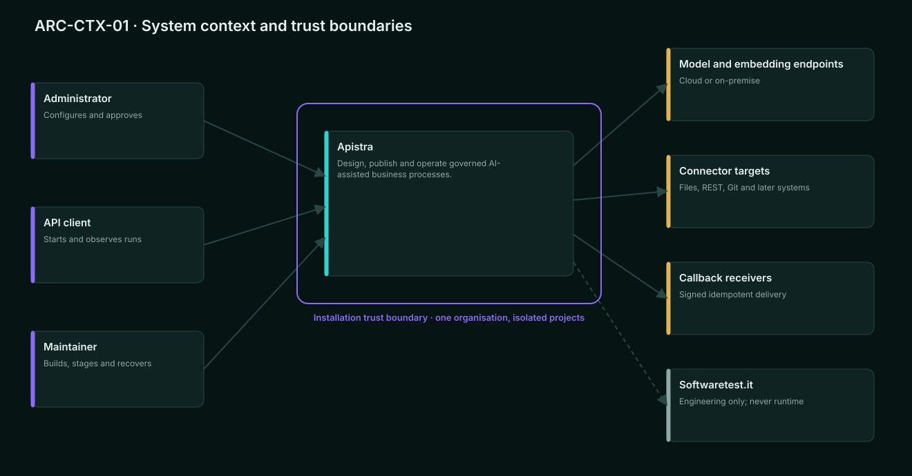
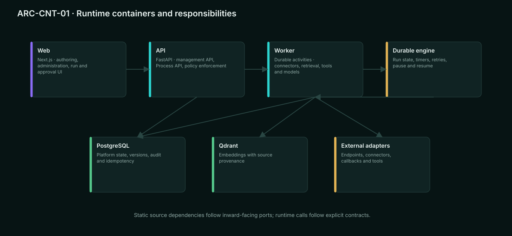
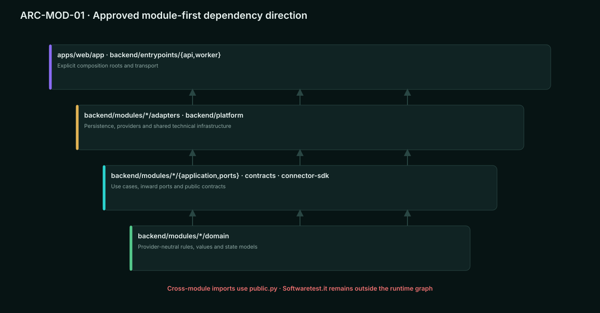
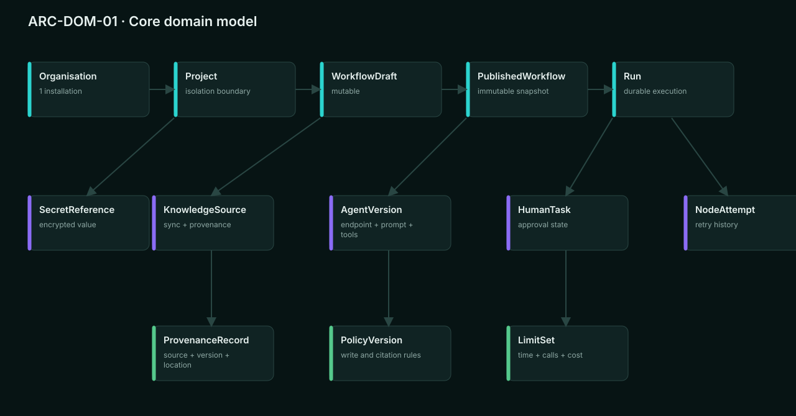
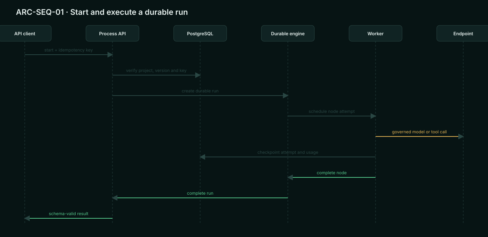
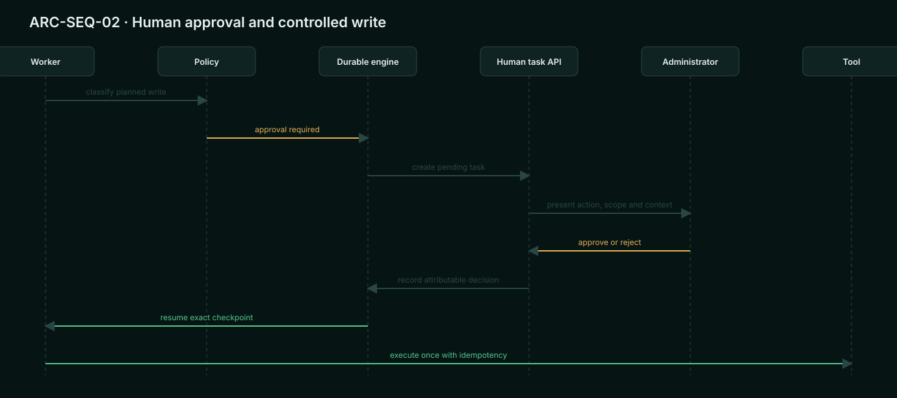
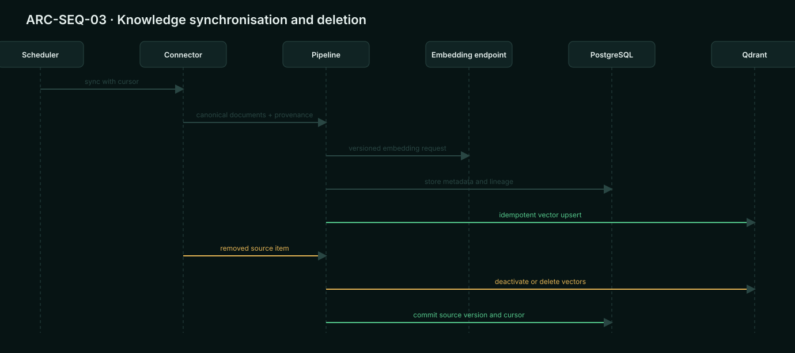
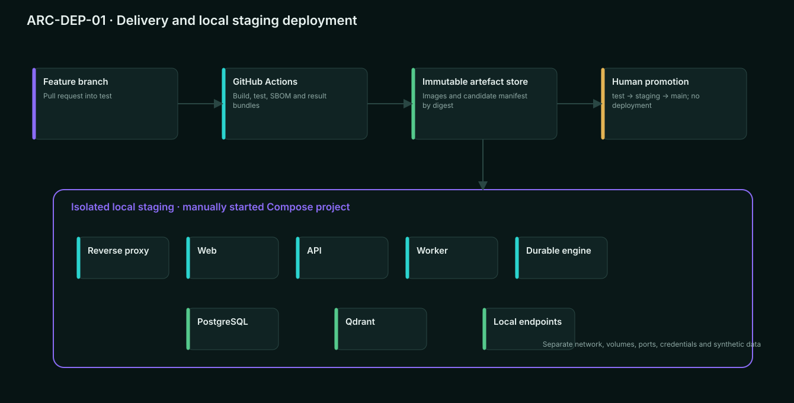

# Apistra Architecture

Version: 0.3-draft
Status: DRAFT
Architecture profile: EXTENDED

## 1. Introduction and goals

Apistra is a platform for composing AI-assisted business processes, publishing immutable workflow versions, and operating durable runs through APIs.

Prioritised quality goals:

1. Security and project isolation
2. Execution correctness and recoverability
3. Auditability and provenance
4. Extensibility without provider lock-in
5. Offline and on-premise operability
6. Testability and controlled delivery
7. Developer usability
8. Performance and cost control

Stakeholders include Administrators, developers, AI engineers, solution architects, operators, security reviewers, commercial licence holders, and maintainers.

## 2. Constraints

- Public AGPL repository with commercial alternative
- No external contributions initially
- English project language
- Next.js and TypeScript for the web application
- Python and FastAPI for APIs and AI integration
- PostgreSQL for platform state
- Qdrant as the initial vector store
- Docker Compose as the first supported deployment model
- One organisation per installation, multiple isolated projects
- Offline operation with local dependencies
- No automatic deployment
- Promotion path: feature branch to test to staging to main
- GitHub Actions for CI orchestration
- Local staging acceptance on a manually started Compose profile
- Softwaretest.it for test management and result reporting
- OWASP ASVS 5.0 Level 2 is the proposed application-security baseline; exact control selection remains a security-review deliverable
- NIST SSDF 1.1 is the proposed secure-development baseline
- WCAG 2.2 AA is the UI accessibility target

## 3. Context and boundaries

Human actors:

- Administrator
- API client operator
- Human approver
- Maintainer or operator

External runtime systems:

- OpenAI or OpenAI-compatible generative endpoints
- Configurable embedding endpoints
- Connector targets such as files, REST services, and Git
- Optional callback receivers
- PostgreSQL
- Qdrant
- Selected durable execution engine

Engineering-only systems:

- GitHub and GitHub Actions
- Container registry or immutable local artefact store
- Softwaretest.it

Trust boundaries:

- Browser to Apistra API
- API client to Process API
- Project boundary inside one installation
- Apistra to each model or embedding endpoint
- Apistra to each connector target
- API service to worker and durable engine
- Services to PostgreSQL and Qdrant
- CI to repository and artefact store
- Local staging environment to operator workstation

Softwaretest.it is never required for normal product runtime.

### 3.1 Context and trust-boundary diagram

Maintainable source and rendered reference:

The diagram source is generated from docs/visuals/generate_visuals.py. It is a target architecture view, not implementation evidence.

## 4. Solution strategy

System style:

- Modular product services packaged as a monorepo
- Separate deployable web, API, and worker processes
- Durable execution delegated to a proven engine selected by ADR
- Ports and adapters at external-provider boundaries
- Explicit domain modules and versioned contracts
- Transactional state in PostgreSQL
- Vector data in Qdrant with replaceable storage port
- Outbox or equivalent reliable hand-off for externally observable events where atomic cross-system writes are impossible

Strategy by quality goal:

- Isolation: mandatory project context and server-side authorisation at every resource operation
- Recoverability: durable checkpoints, idempotency, explicit run state machine, and tested restore
- Extensibility: stable connector, model, embedding, vector-store, tool, identity, and licence ports
- Auditability: immutable published definitions, versioned policies, correlated run events, and source provenance
- Offline operation: no required SaaS dependency in the runtime path
- Controlled delivery: immutable images, exact candidate evidence, local staging, and human promotion

## 5. Building-block view

### 5.1 Approved repository and deployable boundaries

- `apps/web` — Next.js user interface, feature-public contracts, and localisation
- `backend` — one installable Python package shared by the API and worker entrypoints
- `backend/src/apistra/modules/<module>` — module-first business ownership with `domain`, `application`, `ports`, `adapters`, and `public.py`
- `backend/src/apistra/entrypoints/api` — API composition root
- `backend/src/apistra/entrypoints/worker` — worker composition root
- `backend/src/apistra/platform` — shared database, observability, and security infrastructure without business ownership
- `contracts/{openapi,workflow,events,connectors}` — canonical language-neutral contracts
- `connector-sdk/python` — public connector contract and compatibility kit
- `deploy/compose` — local, test, and isolated staging profiles
- `engineering/softwaretest` — publishing and result-reporting adapter outside the product runtime graph
- `tests/architecture-fixtures` — retained allowed and forbidden dependency graphs
- `tools/architecture` — repository architecture checks

The boundaries and the representative `projects` module skeleton are implemented. Empty product modules are not pre-created; every new module must satisfy the same enforced internal structure when its capability workorder introduces it. No API, worker, or business behaviour is implied by this foundation.

### 5.2 Domain modules

- Identity and Administration
- Organisations and Projects
- Secrets and Endpoint Catalogue
- Connectors and Source Synchronisation
- Knowledge and Retrieval
- Agents and Tools
- Workflow Authoring and Versioning
- Runtime and Runs
- Human Tasks
- Policies and Limits
- Evaluation
- Audit and Observability
- Licensing

### 5.3 Dependency direction

Domain and application modules define behaviour and ports. Framework, database, provider, transport, and vendor types remain in adapters. Deployable services compose implementations at their outer boundary.

No module may read another module's tables directly. Python cross-module imports use only `modules.<name>.public`; semantic interaction uses a documented application contract, query interface, or versioned event. Dependencies point inward: domain; then application and ports; then adapters; then the API or worker composition root.

### 5.4 Container and module diagrams

### 5.5 Core domain model

The domain model deliberately shows only architecturally significant aggregates and versioned entities. It is not a generated inventory of implementation classes.

## 6. Runtime view

### 6.1 Publish workflow

1. Administrator edits a mutable draft.
2. The API validates graph, node contracts, schemas, references, limits, and policy.
3. A test execution uses an explicit draft snapshot.
4. Publish creates an immutable complete snapshot and version identifier.
5. The Process API exposes the published version.

### 6.2 Start and execute run

1. API client authenticates with a project API key.
2. The API validates project, workflow version, input schema, idempotency key, and limits.
3. The API creates or returns the existing run and responds with 202 and the run ID.
4. The durable engine schedules work.
5. Workers execute nodes through provider-neutral ports.
6. Each attempt records correlated state, usage, safe diagnostics, and checkpoint.
7. The run reaches completed, failed, cancelled, or waiting state.
8. The result endpoint returns schema-valid output when completed.
9. An optional callback is delivered idempotently with retry and signed authenticity.

### 6.3 Human approval

1. A writing action reaches a policy decision.
2. Default policy creates a pending human task.
3. The durable run checkpoints and waits.
4. An Administrator reviews input, context, planned action, and scope.
5. Approval resumes the exact run state.
6. Rejection terminates the configured path and records the required reason.
7. Timeout follows the configured non-executing path.

### 6.4 Knowledge synchronisation

1. Scheduler or Administrator requests synchronisation.
2. Connector enumerates changes with a stable cursor where supported.
3. Content is extracted, normalised, classified, and linked to source provenance.
4. Chunking and embedding use versioned configuration.
5. Qdrant is updated idempotently.
6. Removed sources deactivate or delete derived vectors.
7. Failures are retryable without duplicating active content.

### 6.5 Recovery

After interruption, the durable engine resumes from a committed checkpoint. Completed non-repeatable side effects are protected by idempotency records or explicit compensation. All attempts remain visible.

### 6.6 Runtime sequence diagrams

## 7. Deployment view

Local development:

- Developer workstation with containers and local source mounts
- Synthetic data only by default

CI:

- GitHub Actions builds and tests
- Untrusted pull-request code has no deployment secrets
- Images and evidence are immutable and content-addressed

Local staging:

- Isolated Docker Compose project and volumes
- No automatic deployment from a branch
- Operator deploys the exact candidate digest
- Staging configuration and secrets are external to the image
- Manual tests execute only after fixture verification

Production:

- No target is currently selected
- No automatic production path exists
- Production release remains DEFERRED and requires a separate human decision and environment contract

Runtime nodes:

- Reverse proxy or ingress
- Web
- API
- Worker
- Durable engine
- PostgreSQL
- Qdrant
- Optional local model and connector targets

### 7.1 Deployment diagram

## 8. Cross-cutting concepts

Identity:
- Local Administrator initially
- Project API keys for Process API clients
- Separate service identities for API, worker, migrations, backup, and CI where applicable

Authorisation:
- Deny by default
- Project context required for all project resources
- Policies are versioned and audited

Versioning:
- Mutable drafts
- Immutable published snapshots
- Versioned schemas, endpoints, prompts, tools, knowledge configuration, and policies
- Secrets referenced by stable identifiers

Reliability:
- Explicit state machines
- Idempotency at API and side-effect boundaries
- Exponential backoff with bounded retries
- Automatic retries only for declared safe operations
- Checkpoints and resumability

Observability:
- Correlation across request, project, workflow version, run, node, attempt, and callback
- Structured logs with secret and payload controls
- Metrics for latency, queueing, errors, retries, token use, cost, and limit decisions
- Distributed traces where supported
- Local-only default

Data lifecycle:
- Configurable metadata and audit retention
- Configurable payload retention
- Optional no-persistence mode for sensitive payloads
- Project export and deletion

Internationalisation:
- Locale-independent domain and API contracts
- English and German message catalogues
- UTC storage with explicit display timezone

## 9. Architecture decisions

The proposed decision and pattern catalogue is maintained in
[Architecture Decisions and Pattern Catalogue](11-architecture-decisions-and-patterns.md).
It becomes binding only after the stated architecture review and planning approval.

Proposed concrete patterns:

- modular monolith for backend domain ownership, deployed as separate API and worker processes;
- Ports and Adapters only at provider, persistence, durable-engine, identity, licence, tool, connector, and engineering boundaries;
- explicit application use cases for every externally triggered operation;
- aggregate repositories plus Unit of Work, with no generic repository per table;
- persisted state machines for run, attempt, human task, synchronisation, callback, and publication lifecycles;
- durable Saga or Process Manager for workflow runs;
- Transactional Outbox and Idempotent Consumer at atomicity and redelivery boundaries;
- Strategy plus Adapter and provider Anti-Corruption Layer for external variants;
- versioned Policy Objects for approval, egress, citation, limits, retention, and evaluation;
- Handler Registry and Factory for approved versioned node types;
- schema-first contracts, optimistic concurrency, and explicit composition roots.

Explicit non-decisions:

- no microservice split for 0.x;
- no generic repository for every table;
- no global CQRS infrastructure;
- no Event Sourcing as platform persistence;
- no distributed two-phase commit;
- no service locator or arbitrary runtime plugin loading.

Pending ADRs:

- Durable execution engine
- Authentication library and session architecture
- Local event transport
- Callback signing format
- Migration tooling

Each pending ADR blocks only the workorders that depend on it.

The approved repository-layout decision is ADR-019. Its executable checks are described in the [Architecture test system](../architecture/testing.md) and run as CI-TS-03.

## 10. Quality requirements

### Architecture rule catalogue

ARCH-001 — Domain independence
- Status: DECIDED
- Rule: Domain modules must not import web, ORM, queue, provider SDK, vector-store, or durable-engine types.
- Allowed: provider-neutral values and ports defined inward.
- Violation: an OpenAI SDK response type in an Agent domain signature.
- Verification: dependency test with allowed and forbidden fixtures; zero violations.

ARCH-002 — Application controls use cases
- Status: DECIDED
- Rule: HTTP handlers, jobs, and workers delegate business decisions to application use cases.
- Violation: a route publishing a workflow directly through ORM calls.
- Verification: structural test plus focused review.

ARCH-003 — Adapter containment
- Status: DECIDED
- Rule: Provider-specific behaviour remains inside its adapter and is translated to canonical contracts.
- Violation: OpenAI-specific finish reasons leaking into workflow rules.
- Verification: contract tests and dependency test.

ARCH-004 — Module data ownership
- Status: DECIDED
- Rule: A module may mutate only its owned data through its public application contract.
- Violation: Knowledge code updating Workflow tables.
- Verification: migration ownership check, dependency analysis, and integration tests.

ARCH-005 — Mandatory project context
- Status: DECIDED
- Rule: Project-scoped use cases require an authenticated project context and cannot accept an unverified raw project identifier.
- Violation: worker activity reading a resource by ID without verified project ownership.
- Verification: type boundary, authorisation tests, and negative cross-project integration tests.

ARCH-006 — Canonical workflow model
- Status: DECIDED
- Rule: Visual, YAML, JSON, validation, execution, and API publication use one canonical versioned schema.
- Violation: visual-editor-only fields changing runtime semantics.
- Verification: round-trip property tests and schema contract tests.

ARCH-007 — Immutable publication
- Status: DECIDED
- Rule: Published workflow snapshots and their semantic dependencies cannot be mutated in place.
- Violation: editing a prompt used by an existing published version.
- Verification: persistence constraints and API integration tests.

ARCH-008 — Durable execution boundary
- Status: DECIDED
- Rule: Long-running state transitions use the selected durable engine through an application port. API processes do not own in-memory run state.
- Violation: approval waits stored only in a web process.
- Verification: restart and recovery tests.

ARCH-009 — Idempotent external effects
- Status: DECIDED
- Rule: Every repeatable external write has a stable idempotency strategy or explicit compensation contract.
- Violation: retrying a payment-like tool call without a key or reconciliation path.
- Verification: fault-injection integration tests.

ARCH-010 — Engineering adapter isolation
- Status: DECIDED
- Rule: Softwaretest.it integration exists outside the product runtime dependency graph.
- Violation: runtime startup failing because Softwaretest.it is unavailable.
- Verification: dependency test and offline runtime test.

ARCH-011 — Explicit composition roots
- Status: DECIDED
- Rule: Deployable services assemble ports and adapters only in documented composition roots.
- Violation: domain code constructing a database or provider client.
- Verification: dependency test and structured review.

ARCH-012 — Stable public contracts
- Status: DECIDED
- Rule: Public API and connector contracts are versioned, schema-validated, and compatibility-tested.
- Violation: silently reinterpreting a published workflow node field.
- Verification: schema diff and consumer contract tests.

ARCH-013 — No cyclic module graph
- Status: DECIDED
- Rule: The source and build dependency graph must be acyclic.
- Verification: architecture test; zero cycles.

ARCH-014 — Local-first runtime
- Status: DECIDED
- Rule: Product startup and configured local execution must not require an external SaaS call.
- Verification: offline Compose acceptance test.

## 11. Risks and technical debt

- Durable engine choice could shape deployment and data ownership. Mitigation: ADR before runtime implementation.
- Visual editor complexity may create a second workflow model. Mitigation: ARCH-006 and round-trip tests.
- Connector extensibility can become arbitrary code execution. Mitigation: built-ins only first, signed isolated plugins later.
- RAG deletion may leave stale vectors. Mitigation: provenance and deletion invariants.
- Long-running side effects can duplicate writes. Mitigation: idempotency and compensation contracts.
- Single Administrator role creates broad privilege. Mitigation: audited actions, strict project context, later role expansion.
- Local staging on a developer-controlled host is less isolated than a dedicated environment. Mitigation: separate Compose project, volumes, credentials, and reproducible reset; revisit before production.
- Logo source rights and vector master are not yet documented. Mitigation: design workorder before public brand release.

No architecture exception is approved.

## 12. Glossary

- Agent: versioned AI behaviour with model endpoint, prompt, tools, knowledge, limits, and policy references.
- Connector: adapter that enumerates and retrieves data from an external source.
- Draft: mutable workflow authoring state.
- Published version: immutable workflow snapshot exposed for execution.
- Run: durable execution of one published workflow version.
- Attempt: one execution attempt for a node or external effect.
- Human task: durable waiting state requiring an authorised decision.
- Knowledge source: versioned ingestion configuration and its provenance graph.
- Process API: generated runtime interface for a published workflow.
- Project: primary isolation boundary inside one installation.
- Candidate: immutable build artefact subjected to a gate.
- Local staging: isolated manually controlled Compose environment used for acceptance.
