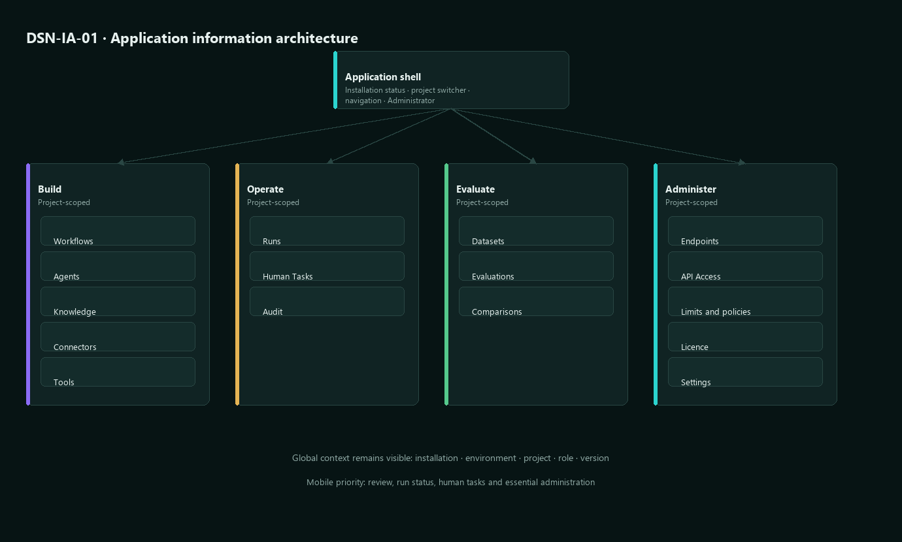
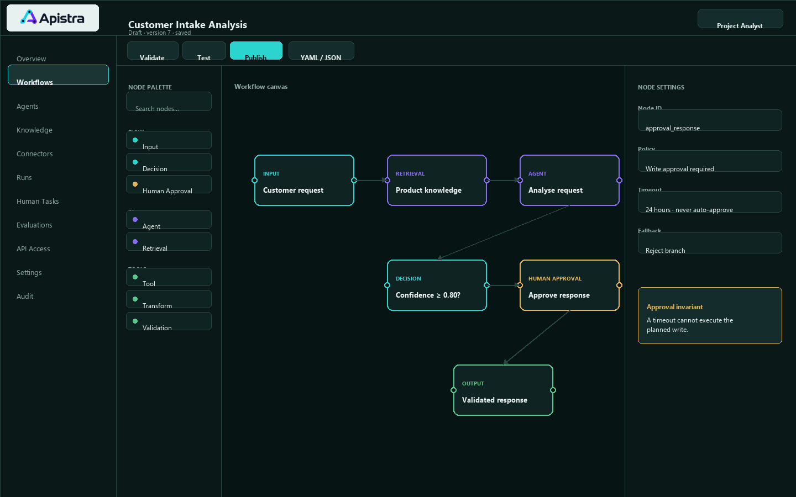
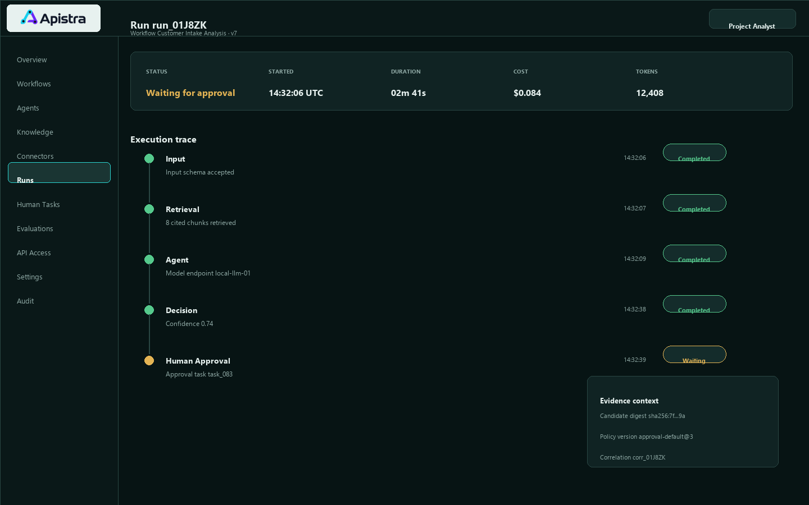
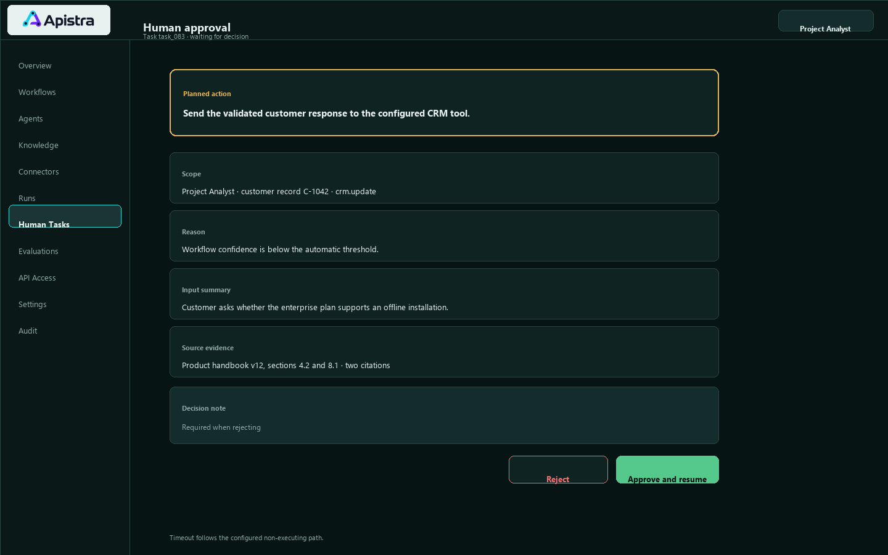
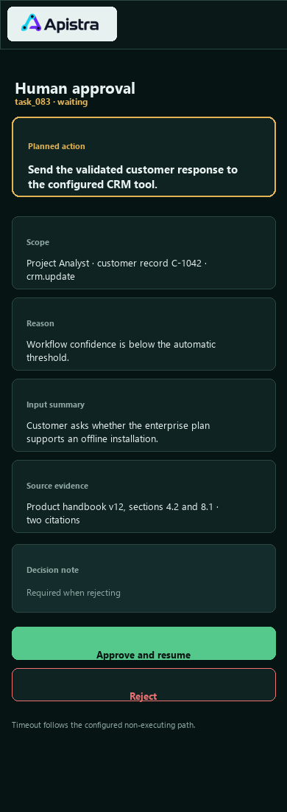
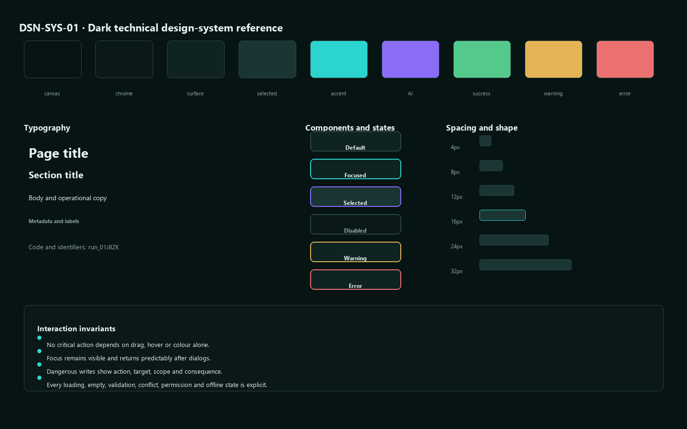

# Apistra UX and UI Design Contract

Version: 0.3-proposed
Status: IN_REVIEW

## 1. Scope and responsibility

This contract covers the 0.x web application, including installation bootstrap, project administration, endpoints, secrets, connectors, knowledge, workflow authoring, run inspection, human tasks, evaluation, and operational views.

The product owner approves the visual reference. An implementation agent cannot approve or invent missing visual decisions.

## 2. Confirmed brand inputs

Canonical current inputs:

- images/apistra-logo-primary.png
- images/apistra-github-avatar.png
- the dark technical workflow-editor screenshot supplied during discovery

Confirmed direction:

- dark technical interface
- high information density suitable for developers and AI engineers
- cyan-to-purple brand accent
- graph and orchestration character
- restrained, professional surfaces

Outstanding brand deliverables:

- documented ownership and usage rights
- vector master
- reversed wordmark for dark surfaces
- monochrome variants
- favicon and application icons
- minimum size, exclusion zone, and misuse rules

No logo redesign is authorised.

## 3. Design principles

1. Make execution state legible before decoration.
2. Keep workflow structure and configuration visible in context.
3. Make dangerous external effects explicit and interruptible.
4. Preserve keyboard access and non-drag alternatives.
5. Show provenance, version, project, and candidate context where decisions are made.
6. Use colour as reinforcement, never as the only status signal.
7. Prefer progressive disclosure over hiding operational detail.

## 4. Information architecture

Global shell:

- Installation status
- Project switcher
- Primary navigation
- Current project and environment
- Administrator menu
- Help and documentation

Project areas:

- Overview
- Workflows
- Agents
- Knowledge
- Connectors
- Model Endpoints
- Tools
- Runs
- Human Tasks
- Evaluations
- API Access
- Settings
- Audit

Initial page inventory:

- DSN-001 Sign in
- DSN-002 Bootstrap Administrator
- DSN-003 Project overview
- DSN-004 Project creation
- DSN-005 Endpoint catalogue and editor
- DSN-006 Secret reference manager
- DSN-007 Connector catalogue and configuration
- DSN-008 Knowledge source details and sync history
- DSN-009 Workflow list
- DSN-010 Visual workflow editor
- DSN-011 Canonical YAML or JSON editor
- DSN-012 Validation and test panel
- DSN-013 Publication review
- DSN-014 Published workflow and API contract
- DSN-015 Run list
- DSN-016 Run trace
- DSN-017 Human task inbox
- DSN-018 Human task decision
- DSN-019 Limits and policies
- DSN-020 Audit log
- DSN-021 Licence status

### 4.1 Information-architecture reference

Maintainable SVG source and generated PNG preview:

### 4.2 Proposed administration interaction baseline

The following English labels and routes are proposed so that the first manual
tests can be reviewed without inventing UI text inside a test case. They are
not approved design decisions and do not authorise implementation or
publication. Product-owner approval of this exact revision is required by
GATE-DES-01.

| Context | Proposed visible contract |
| --- | --- |
| DSN-001 Sign in | Fields `Username` and `Password`; primary action `Sign in`; conditional bootstrap action `Create Administrator` |
| Failed sign-in | Inline alert `Sign-in failed. Check your credentials and try again.`; do not disclose whether the username exists |
| Expired or revoked session | Inline alert `Your session has expired. Sign in again.` followed by DSN-001 |
| DSN-002 Bootstrap Administrator | Fields `Username`, `Password`, and `Confirm password`; primary action `Create Administrator`; secondary action `Back to sign in` |
| Completed bootstrap | Status `Administrator bootstrap is complete.`; no second creation form is rendered |
| Authenticated shell | Project selector accessible name `Current project`; administrator menu accessible name `Administrator menu` |
| Administrator menu | Actions `Installation status` and `Sign out` |
| DSN-003 Project overview | Page title `Project overview`; primary action `Create project`; navigation items `Overview` and `Audit` |
| DSN-004 Project creation | Fields `Project name` and `Project key`; primary action `Create project`; secondary action `Cancel` |
| Required field validation | Inline message `This field is required.` associated with the empty field |
| Duplicate project key | Inline message `Project key is already in use.` associated with `Project key` |
| Unauthorised or unknown project | Page title `Project not found`; body `The project does not exist or you do not have access.`; no project metadata is rendered |
| Audit evidence | Page title `Audit log`; event labels `administrator.bootstrap.completed`, `session.revoked`, and `project.created` |

### 4.3 Proposed navigation paths for DSN-001 through DSN-004

1. A logged-out visit to the application root resolves to DSN-001 `Sign in`.
2. When bootstrap is available, `Create Administrator` on DSN-001 opens
   DSN-002. It is absent after bootstrap has completed.
3. Successful bootstrap opens DSN-003 `Project overview`. If no project exists,
   the view presents an empty state and the `Create project` action.
4. Successful sign-in opens the last authorised project on DSN-003. If none
   exists, the same empty state is shown.
5. `Create project` opens DSN-004. `Cancel` returns to DSN-003 without creating
   a project.
6. Successful project creation returns to DSN-003 with the new project selected
   in `Current project`.
7. `Audit` opens DSN-020 `Audit log`; returning through `Overview` opens
   DSN-003.
8. `Administrator menu` > `Installation status` opens the installation-status
   view containing the immutable bootstrap-complete state.
9. `Administrator menu` > `Sign out` revokes the active session and returns to
   DSN-001.

Direct URLs are stable test inputs, not visible navigation labels:

- `STAGING_SIGN_IN_URL`
- `STAGING_BOOTSTRAP_URL`
- `STAGING_PROJECT_OVERVIEW_URL`
- `STAGING_PROJECT_URL_TEMPLATE`, containing `{project_id}`

### 4.4 Proposed administration state rules

- Password values are masked, are never copied into evidence, and are supplied
  only through protected execution parameter `STAGING_ADMIN_PASSWORD`.
- Submitting an invalid sign-in retains `Username`, clears `Password`, moves
  focus to the sign-in error, and does not identify which credential failed.
- Bootstrap availability is decided server-side and is race-safe. A stale or
  direct second bootstrap request renders only the completed state.
- Project creation remains disabled until both required fields are non-empty.
- `Project key` is normalised to uppercase and accepts only `A-Z`, `0-9`, and
  `-`; validation does not silently change an already submitted key.
- The project selector exposes only authorised projects. Direct access to an
  existing but unauthorised project is indistinguishable from an unknown
  project in status, title, body, and rendered metadata.
- Every successful bootstrap, session revocation, and project creation produces
  one attributable audit event with actor, UTC timestamp, correlation ID, and
  affected installation or project identifier.

### 4.5 Review boundary for revision 0.3

Revision 0.3 proposes only the labels, paths, and states needed to review the
first `MTP-PRC-01` cases. It does not finalise the visual treatment of DSN-001
through DSN-004 and does not change the approval state of any other page.
Manual definitions may be drafted against this proposal, but they remain
`DRAFT`, `NOT PUBLISHED`, and `NOT EXECUTED` until this revision is approved and
the named fixture and publication gates are satisfied.

## 5. Workflow editor contract

Large viewport:

- Top bar: workflow identity, draft or published state, version, save, validate, test, publish, layout, fit, canonical editor switch
- Left rail: searchable node palette grouped by flow, AI, tools, and data
- Centre: zoomable graph canvas
- Right inspector: selected node configuration, validation, policy, and version impact
- Lower or contextual panel: validation, run preview, trace, and diagnostics

Required non-drag interaction:

- Nodes can be added through keyboard-accessible commands.
- Connections can be created and inspected without pointer-only drag.
- Auto-layout does not change workflow semantics.

Canonical editor:

- Shows the same model as the visual canvas.
- Validation errors identify schema path and corresponding visual node.
- Switching representation cannot silently discard information.

### 5.1 DSN-010 workflow-editor reference

This view defines information hierarchy and interaction placement. It does not assert implemented behaviour or final pixel identity.

### 5.2 DSN-016 run-trace reference

### 5.3 DSN-018 human-approval references

Desktop:

Mobile full-page view:

## 6. Design tokens

Final values require rendered review. Required token roles:

- background.canvas
- background.application
- surface.default
- surface.elevated
- surface.interactive
- text.primary
- text.secondary
- text.disabled
- border.default
- border.strong
- accent.primary
- accent.secondary
- focus.visible
- status.information
- status.success
- status.warning
- status.error

Required scales:

- type hierarchy for page title, section, body, label, code, and metadata
- spacing
- radius
- border
- z-index
- motion duration and easing

No product state may be communicated by cyan, purple, green, amber, or red alone.

### 6.1 Design-system reference

## 7. Component contracts

Priority components:

- Application shell
- Project switcher
- Navigation
- Data table
- Search and filter
- Form fields
- Secret input
- Endpoint selector
- Code editor
- Workflow node
- Connection and port
- Node palette
- Inspector panel
- Validation summary
- Status badge
- Limit meter
- Confirmation dialog
- Human approval card
- Run timeline
- Trace tree
- Toast and inline alert
- Empty, loading, error, offline, and permission states

Each component requires default, hover, focus, active, selected, disabled, loading, success, warning, and error states where applicable.

## 8. Responsive behaviour

Primary authoring target:

- Desktop width suitable for dense workflow design

Tablet:

- Canvas remains usable
- Palette and inspector become drawers
- No action is hover-only

Mobile:

- Supports review, run status, human tasks, and essential administration
- Full graph authoring may use a structured node list rather than reproducing the desktop canvas
- No critical approval information is truncated

Exact reference viewports are selected during the visual-reference workorder.

## 9. Accessibility

Target: WCAG 2.2 AA.

Required:

- semantic landmarks and headings
- complete keyboard path
- visible non-obscured focus
- accessible names, roles, values, and live status
- contrast measurement
- zoom and reflow
- reduced motion
- accessible graph alternatives
- error association and correction guidance
- minimum target sizes
- screen-reader smoke test for sign-in, workflow validation, publication, run inspection, and approval

## 10. Content and internationalisation

- English is the source locale.
- German is the first additional locale.
- No user-facing string is embedded in domain rules.
- Layouts allow text expansion.
- Dates and times include timezone context.
- Code, identifiers, API fields, and machine statuses remain stable English contracts.
- Errors state what happened, which input or action is affected, and a safe correction path.
- Sensitive provider or infrastructure details are not exposed.

## 11. Page states

Every relevant view defines:

- initial and loading
- empty
- populated
- success
- validation error
- technical error and retry
- conflict
- permission denied
- expired session
- disabled or archived
- offline or endpoint unavailable
- large data and pagination

The editor additionally defines:

- invalid graph
- unresolved reference
- unsaved changes
- concurrent draft modification
- published read-only version
- run in progress
- limit warning and hard stop

## 12. Visual evidence gate

The dark direction is selected, but the design gate is not yet passed.

Now present:

- maintainable repo-native generator and SVG sources;
- generated PNG review previews;
- workflow-editor, run-trace, and human-approval references;
- desktop and mobile approval views;
- information architecture;
- initial token roles and component-state reference.

Still required before the first UI workorder is READY:

- product-owner review and explicit approval or correction of proposed reference version 0.3;
- logo rights, vector master, reversed wordmark, monochrome and icon variants;
- measured contrast, keyboard, focus, reflow, reduced-motion, and screen-reader evidence;
- detailed references for validation, error, conflict, permission, disabled, loading, empty, and offline states;
- final light-surface or print treatment where applicable;
- manual UI and UX test definitions published through the verified Softwaretest.it API.

The research screenshot is inspiration, not implementation evidence.

## 13. Design workorder status

- Brand direction: DECIDED
- Existing logo input: DECIDED
- Logo rights and production variants: BLOCKING for public brand release
- Information architecture: IN_REVIEW
- Tokens and component details: IN_REVIEW
- Rendered reference sources: PRESENT, approval pending
- Accessibility test oracles: DRAFT
- Human design approval: PENDING
- Administration labels and paths for DSN-001 through DSN-004: PROPOSED, approval pending
